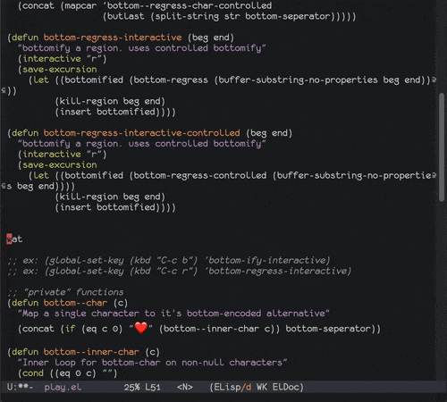

# bottom-el

# show me!

## dafuq

Start here:

https://github.com/bottom-software-foundation/spec
https://github.com/bottom-software-foundation/bottom-rs

## why elisp?

because you should be able to speak bottom with æ lisp

## minor mode?

later. tbh, this would just add keybinds, and you probably want direct control
over those, if you want them at all.

## did you test cyrrilic?

yup!

## please add...

nah

_prs welcome_

## how do i use it?

- clone the repo somewhere
- in emacs
- - `M-x load-file /path/to/repo/bottom.el`
- - highlight a region
- - `M-x bottom-ify-interactive`
- bask

read the source for more (bad) ideas

## how do i run the tests?

`emacs -batch -l ert -l bottom.el -l bottom-test.el -f ert-run-tests-batch-and-exit`

## anything else i should know?

honestly? you should probably turn back now. this will not improve
your life. delete the cloned repo. uninstall emacs. give your computer
to charity. get thee to a nunnery. repent now, before it is too late.
